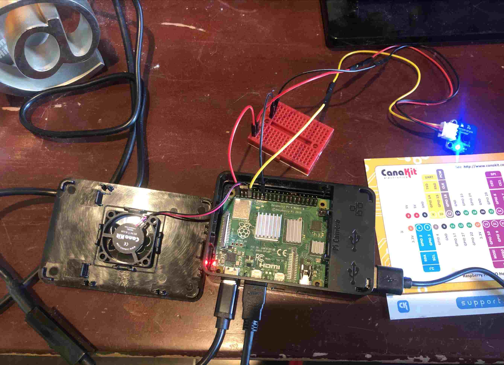

# 7_temperature

Making SunFounder DS18B20 Temperature Sensor Module for Arduino and Raspberry Pi work

## References

REF: https://www.amazon.com/gp/product/B013GB27HS/
REF: https://thepihut.com/blogs/raspberry-pi-tutorials/gpio-and-python-79-temperature-sensor

## Do this first to get the I2C working in 1 wire mode

```
sudo raspi-config
# Interfacing Options
# I2C
# Yes

sudo vim /boot/config.txt 
# add this to the bottom without the #
#dtoverlay=w1-gpio

sudo shutdown -h now
```

## Now wire up like this



## Setup python3 Virtual Env

```
cd
mkdir -p venvs
cd venvs
python3 -m venv temperature
source temperature/bin/activate
```

## Clone this repo

```
cd
mkdir -p code
cd code
git clone https://github.com/gddk/rpi.git
cd rpi/7_temperature
```

## Run the code
```
(temperature) pi@raspberrypi:~/code/temperature $ ./7_temperature.py
66.99F, 19.44C
```


## Send to graphite every 60s
Get this running in a tmux or screen session and just let it go on and on
```
while [ 1 ]; do
    t=$(/home/pi/code/rpi/7_temperature/7_temperature.py)
    val_f="solar.temp_f $(echo $t | egrep -o '^[0-9.]*') $(date +%s)";
    val_c="solar.temp_c $(echo $t | egrep -o '[0-9.]*C$' | sed -e 's/C//') $(date +%s)"
    echo "$(date +"%Y-%m-%d %H:%M") $val_f"
    echo "$(date +"%Y-%m-%d %H:%M") $val_c"
    echo $val_f | nc -N localhost 2003
    echo $val_c | nc -N localhost 2003
    sleep 60
done
```

or better yet, put it in cron:
```
echo "* * * * * pi /home/pi/code/rpi/7_temperature/7_temperature.sh > /tmp/7_temperature.last.log" | sudo tee /etc/cron.d/7_temperature
```

Realizing we do not need python for this:

```
echo "* * * * * pi /home/pi/code/rpi/7_temperature/7_temperature_pure_bash.sh > /tmp/7_temperature.last.log" | sudo tee /etc/cron.d/7_temperature
```

NOTE: all cron entries are in [../cron.d/rpi](../cron.d/rpi)

## import temperature

It would be nice to be able to import a class in python that can easily fetch the temperature, so lets make one!

See [temperature.py](temperature.py). Here is how to use it:

```
from temperature import Temperature

t = Temperature(30)
print('The temperature is %sF' % t.F)
print('The temperature is %sC' % t.C)
```

The reason we do Temperature(30) is that it takes about 1 second to read the 1 wire device, so we want to cache the answer.
30 is the number of seconds to cache the answer for.


## Monitoring with PagerDuty

Using grafana to send alerts to PagerDuty when temperature thresholds are breached.
