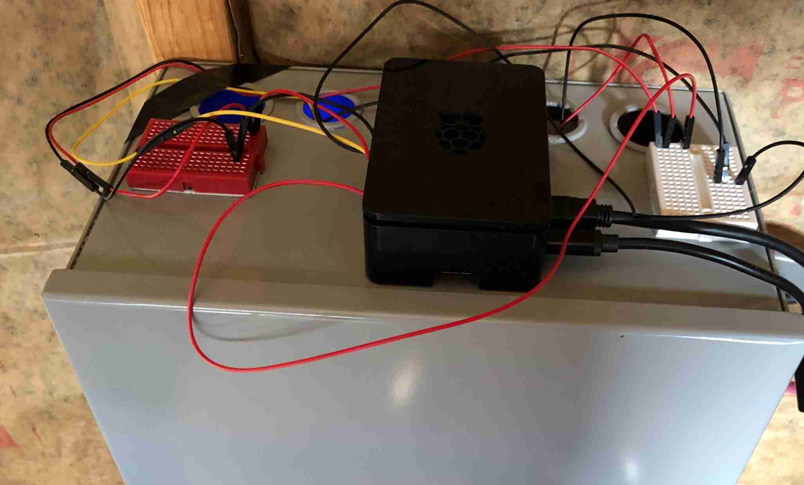
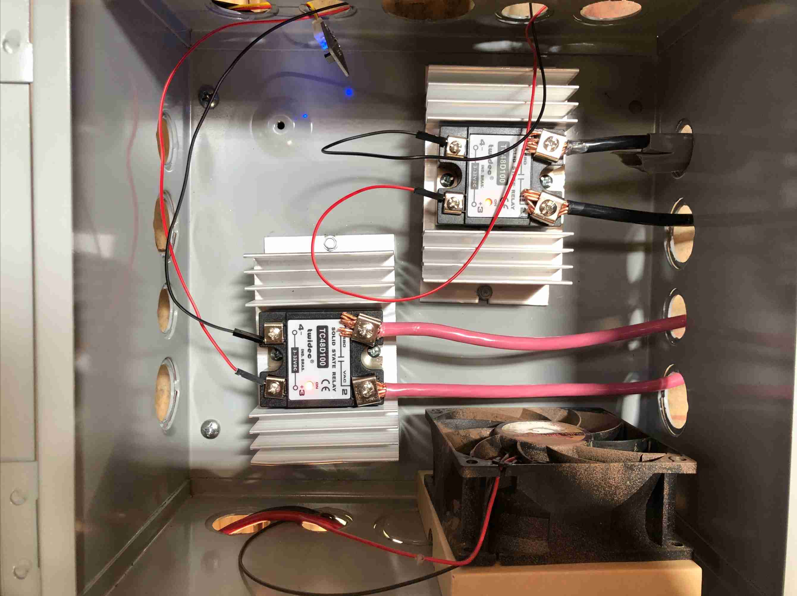

# rpi
Personal rasberry pi projects

## Overview

Raspberry Pi to control a pair of SSR to maximize efficiency of solar use. By toggling these SSRs to the ON position, I'm essentially doing a pass through of grid power to the load. The inverter prioritizes grid power, so if it's there, it does a pass thru and does not use the battery bank. The raspberry pi will monitor the battery voltage and when too low (i.e. ~65% DOD), toggle ON the the SSRs to trigger the inverter to switch from battery powered to grid powered.

Also to gather health stats of the solar shed for graphing over time.

Also to monitor health stats and alert, through PagerDuty [PageDuty](https://www.pagerduty.com/) 





At this point, 2021-03-20, the SSRs didn't work at first when I had it connected to GPIO. The LED came on and I detected 120V on both sides of the SSR, but the AIMS inverter wouldn't accept it. Then I read in the reviews of the SSR that raspberry pi GPIO pushes enough current to light up the LED and make about half of the AC current flow, but to make it actually work, have to connect it to the 5V power supply. The current used at 3.6VDC is 6.4mA, which is more than GPIO can push. At 5VDC it'll be closer to 5mA. Solution:  5V -- (SSR) > -- (collector,2n3904 npn Transistor,emmitter) -- GND. Then the GPIO -- 10kΩ -- 4.7kΩ --  (base,2n3904 npn Transistor). (edited) 

Here are all the parts purchased for this project; some not yet arrived.

* [CanaKit Raspberry Pi 4 8GB Starter Kit - 8GB RAM ](https://www.amazon.com/gp/product/B08956GVXN/)
* [Twidec/Output Single Phase SSR Solid State Relay 100A 3-32V DC to 24-480V AC SSR-100DA](https://www.amazon.com/gp/product/B07P78BVM7/) * 2
* [uxcell Aluminum Heat Sink SSR Dissipation for Single Phase Solid State Relay 10A-100A](https://www.amazon.com/gp/product/B07C8R7MS2/) * 2
* [SunFounder DS18B20 Temperature Sensor Module for Arduino and Raspberry Pi](https://www.amazon.com/gp/product/B013GB27HS/)
* [EDGELEC 120pcs Dupont Wire 10cm 15cm 20cm 30cm 40cm 50cm 100cm Optional Breadboard Jumper Wires Assorted Kit Male to Female Male to Male Female to Female Multicolored Ribbon Cable](https://www.amazon.com/gp/product/B07GD1TH2K/)
* [EDGELEC 120pcs Breadboard Jumper Wires 10cm 15cm 20cm 30cm 40cm 50cm 100cm Optional Dupont Wire Assorted Kit Male to Female Male to Male Female to Female Multicolored Ribbon Cable](https://www.amazon.com/gp/product/B07GD1XFWV/)
* [FTCBlock Mini Solderless Breadboard 170 tie-pointskit for Arduino 6 PCS](https://www.amazon.com/gp/product/B07H2RPYMP/)
* [BUD Industries JBH-4961-KO Steel NEMA 1 Sheet Metal Box with Knockout and Hinged Cover, 10" Width x 10" Height x 6" Depth, Gray Finish](https://www.amazon.com/gp/product/B005UPA10Y/)
* [Ableconn PI232DB9M Compact GPIO TX/RX to DB9M RS232 Serial Expansion Board for Raspberry Pi](https://www.amazon.com/gp/product/B00WPBXDJC/)
* [StarTech.com 2m Black Straight Through DB9 RS232 Serial Cable - DB9 RS232 Serial Extension Cable - Male to Female Cable MXT1002MBK, 6.6 ft / 2m](https://www.amazon.com/gp/product/B00A6GIUZA/)
* [ALLDREI 0 Ω to 1 Mega Ohm Resistors Assortment Kit](https://www.amazon.com/gp/product/B07D433FZG/)
* [MCIGICM 200pcs 2n3904 npn Transistor, 2n3904 Bipolar BJT Transistors NPN 40V 200mA 300MHz 625mW TO-92-3](https://www.amazon.com/gp/product/B06XRBLKDR/)

## Temperature Sensing

This was the first project and the very first thing I did with the raspberry pi. I need to get alerted if the temperature is too high, i.e. above 95F. I plan to take some immediate measures of toggling OFF grid power, in case the problem is too much AMPs going through the SSRs, which puts off heat. Maybe the fan inside the electric box failed? Granted, if I switch to grid power at night or on a cloudy day, I could run out of battery, especially considering it got toggled ON to grid power when reaching a low threshold, ie 65% DOD, so there isn't much left on the batteries anyway. Luckily the inverter will auto shutdown if the battery voltage drops below 49%.

See [7_temperature](7_temperature/) for all the details. 

## Heartbeat monitorting

In the last example, what if the scneario occurs where grid power is OFF and battery runs below 49% and inverter turns off and raspberry pi is therefore powered off? Since the raspberry pi is performing the monitoring, I need to know if it's not running! Hence heartbeat.

The model is this: every 5 minutes the raspberry pi uploads a file to AWS S3. Then a Lambda is triggered every 5 minutes that checks the Last-Modified time stamp of that file. If the Last-Modified gets too old, i.e. 15 minutes, then trigger alert to PagerDuty.

See [heartbeat](heartbeat/) for all the details.

## Make nginx https and proxy grafana

This is so when viewing from external, ie cafe, the data is encrypted while in transit, especially grafana username/password!

This examples uses port 30000, you can use any port you want. I just choose 30000 for ease of remembering and certainly not commonly used for something else.

```
sudo openssl req -x509 -nodes -days 365 -newkey rsa:2048 -keyout /etc/ssl/private/nginx-selfsigned.key -out /etc/ssl/certs/nginx-selfsigned.crt
```

REF: https://www.digitalocean.com/community/tutorials/how-to-create-a-self-signed-ssl-certificate-for-nginx-in-ubuntu-18-04

/etc/nginx/sites-enabled/default

```
server {
    listen 30000 ssl;
    listen [::]:30000 ssl;
    include snippets/self-signed.conf;
    include snippets/ssl-params.conf;

    location / {
        proxy_set_header X-Real-IP $remote_addr;
        proxy_set_header X-Forwarded-For $proxy_add_x_forwarded_for;
        proxy_set_header Host $http_host;
        proxy_set_header X-NginX-Proxy true;

        proxy_pass "http://127.0.0.1:3000";
        proxy_redirect off;
    }
}
```

snippets/self-signed.conf

```
ssl_certificate /etc/ssl/certs/nginx-selfsigned.crt;
ssl_certificate_key /etc/ssl/private/nginx-selfsigned.key;
```

snippets/ssl-params.conf

```
ssl_protocols TLSv1.2;
ssl_prefer_server_ciphers on;
ssl_ciphers ECDHE-RSA-AES256-GCM-SHA512:DHE-RSA-AES256-GCM-SHA512:ECDHE-RSA-AES256-GCM-SHA384:DHE-RSA-AES256-GCM-SHA384:ECDHE-RSA-AES256-SHA384;
ssl_ecdh_curve secp384r1; # Requires nginx >= 1.1.0
ssl_session_timeout  10m;
ssl_session_cache shared:SSL:10m;
ssl_session_tickets off; # Requires nginx >= 1.5.9
ssl_stapling on; # Requires nginx >= 1.3.7
ssl_stapling_verify on; # Requires nginx => 1.3.7
resolver 8.8.8.8 8.8.4.4 valid=300s;
resolver_timeout 5s;
add_header X-Frame-Options DENY;
add_header X-Content-Type-Options nosniff;
add_header X-XSS-Protection "1; mode=block";
```
