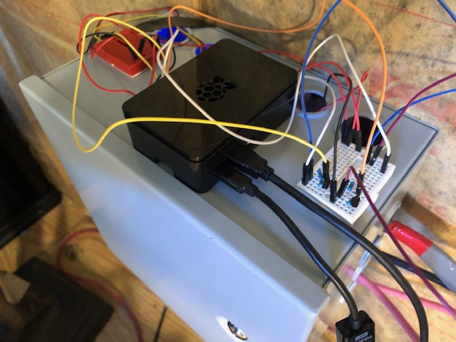
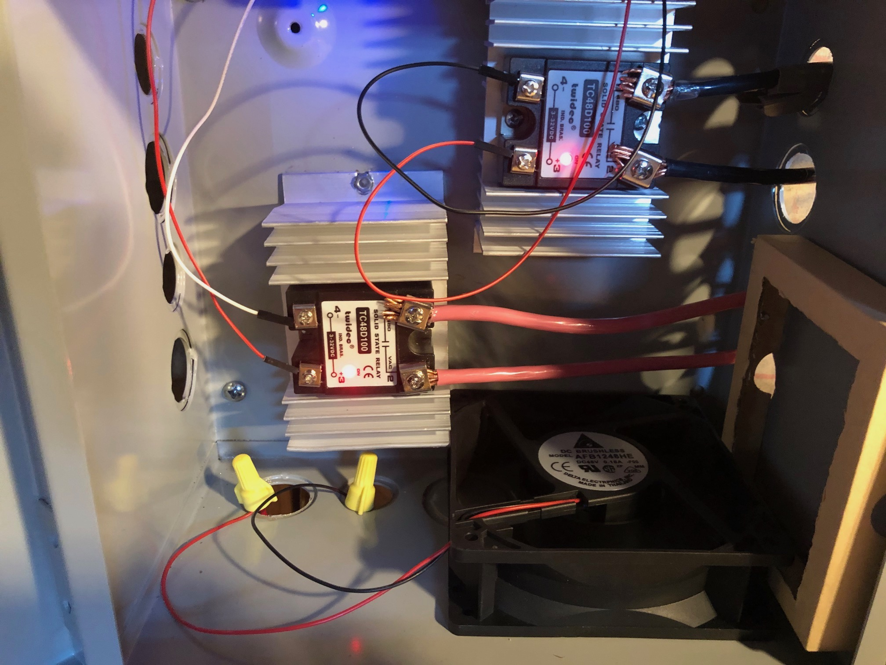
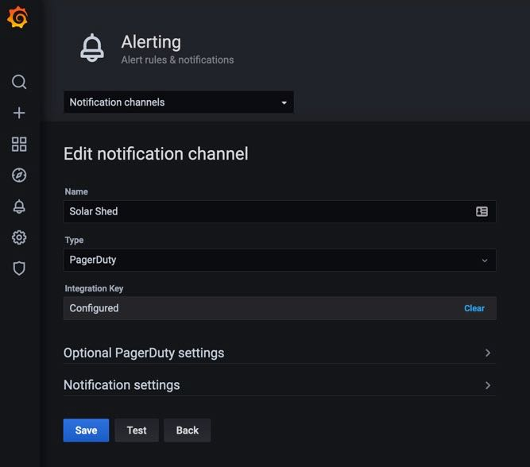
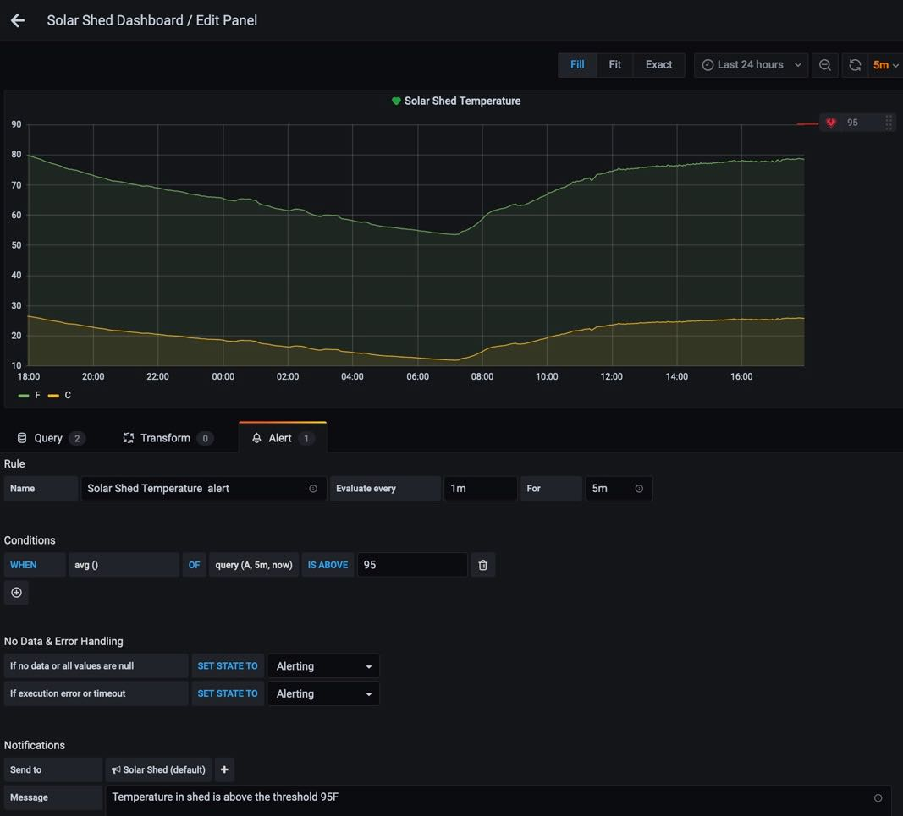
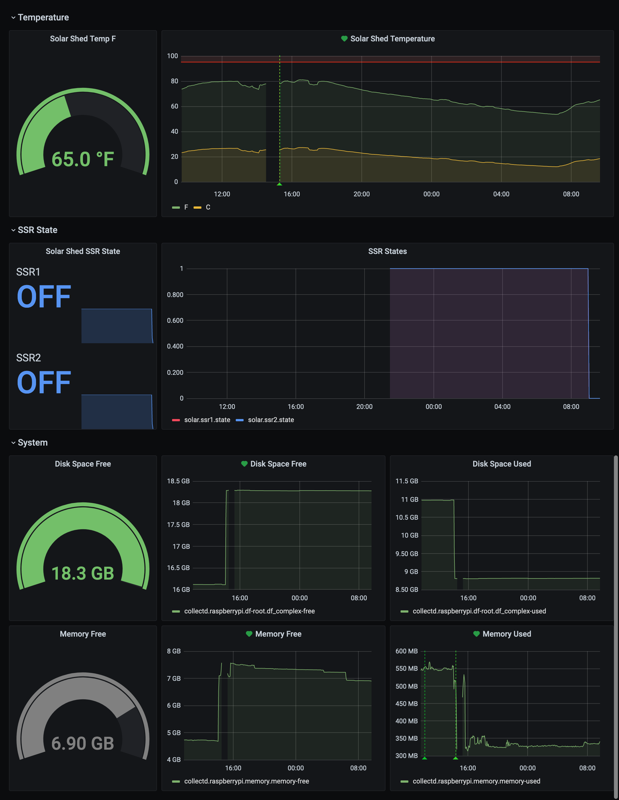
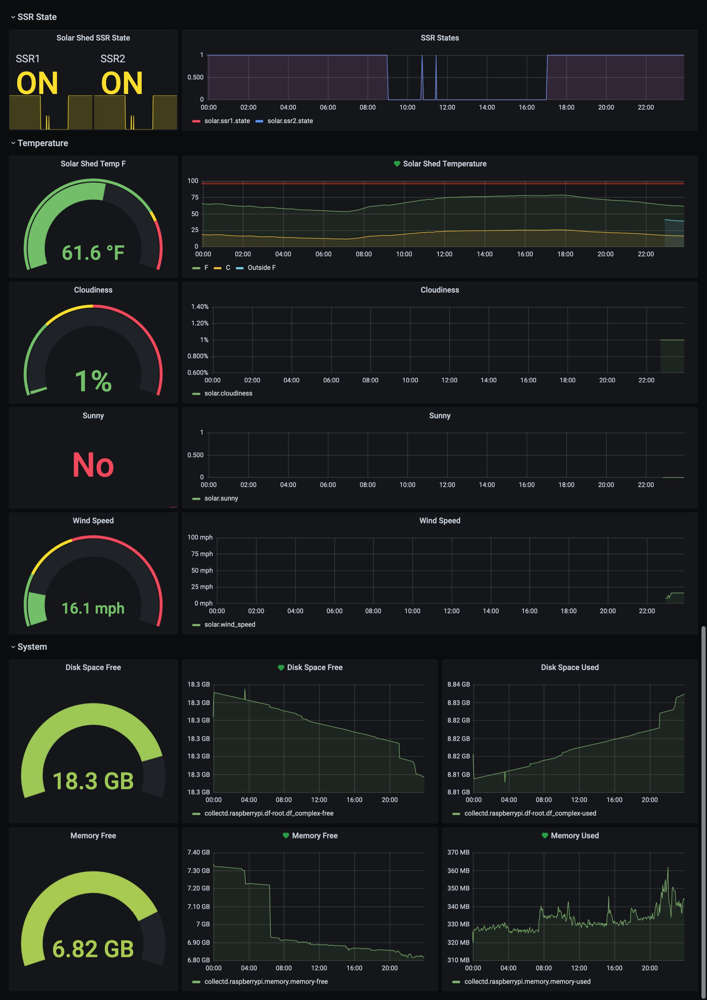
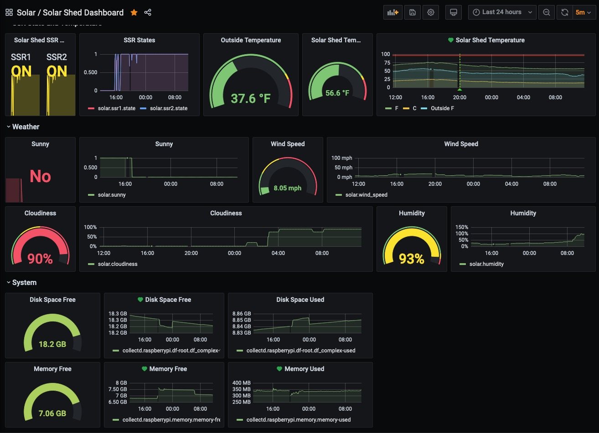

# rpi
Personal rasberry pi projects

## Overview

Raspberry Pi to control a pair of SSR to maximize efficiency of solar use. The inverter is configured to prioritize grid power, so if it's there, it does a pass thru and does not use (aka invert) the battery bank. Therefore, by toggling these SSRs to the ON position, this is powering the load from the grid. The raspberry pi will monitor the battery voltage and when too low (i.e. ~65% DOD), toggle ON the the SSRs to trigger the inverter to switch from battery powered to grid powered.

This repo also gathers health stats of the solar shed for graphing over time. It uses [graphite](https://graphiteapp.org/), [grafana](https://grafana.com/), [collectd](https://collectd.org/).

It also monitors health stats and does alerting, through PagerDuty [PageDuty](https://www.pagerduty.com/) and [AWS](https://aws.amazon.com/).





2021-03-20 Note: The SSRs didn't work at first when connected to GPIO. The LED came on and detected 120V on both sides of the SSR, but the inverter wouldn't accept it. Reviews of the SSR stated raspberry pi GPIO pushes enough current to light up the LED and make about half of the AC current flow, but to make it actually work, have to connect it to the 5V power supply. The current used at 3.6VDC is 6.4mA, which is more than GPIO can push. At 5VDC it'll be closer to 5mA. 

Solution:  5V -- (SSR) > -- (collector,2n3904 npn Transistor,emmitter) -- GND. Then the GPIO -- 10kΩ -- 4.7kΩ --  (base,2n3904 npn Transistor).

How do we know to use 14.7kΩ of resistors!?  Ohms Law. V = RI. We need to solve for R, so R=V/I.

Here are the specs of the 2n3904 npn Transistor purchased

```
Transistor Type:NPN
Current - Collector (Ic) (Max):200mA
Voltage - Collector Emitter Breakdown (Max):40V
Vce Saturation (Max) @ Ib, Ic:300mV @ 5mA, 50mA
DC Current Gain (hFE) (Min) @ Ic, Vce:100 @ 10mA, 1V
Power - Max:625mW
Frequency - Transition:300MHz
Mounting Type:Through Hole
Supplier Device Package:TO-92 
```

* The 2n3904 npn Transistor requires 0.7V at 0.18mA, or 0.00018 A, to activate. The actual I(B), or β, or Beta, is dependent on the current through the collector and emitter. Not sure how to calculate this.  I(B) = I(C) / β. I(C) = 4.6mA = 0.0046A. The β spec is "DC Current Gain (hFE) (Min) @ Ic, Vce:100 @ 10mA, 1V". Our circuit is 4.6mA, not sure how to do this math, so let's use β of 100. I(B) = 0.004.6/100 = 0.000046. 2.6V/0.000046 = 57kΩ. Closest resistor in stock is 47kΩ, if we used that I = V/R = 2.6/47000 = 0.000055 A = 0.0055mA. That "seems" too little. Lets stick with 0.18mA needed. Or, can we assume that Gain of 100 @ 10mA means 46 @ 4.6mA? Then I(B) = 0.0046 / 46 = 0.0001. Then R = 2.6/ 0.0001 = 26,000 Ω. Are we splitting hairs? Anything less than 1mA isn't drawing too much current. What is at risk if we do not use enough resistance? Too little resistance and we fry the transistor? Or worse the raspberry pi. Too much resistance and the transistor does not operate. There is likely a range of acceptable current and as long as we are in that range, all will be fine. Sticking with 0.7V and 0.18mA. If we fry the transistor, they are super cheap, will replace and up the resistance. I suppose we could try the 47kΩ and see if the transistor will operate.
* The GPIO pin puts out 3.3V
* V = 3.3V - 0.7V = 2.6V
* I = 0.00018 A - this is how little current will be taken from the GPIO pin to activate the transistor.
* R = 2.6V / 0.00018A = 14444 Ω = 14.4kΩ. 

Since what we have is 10kΩ and 4.7kΩ we can connect them in series to make 14.7kΩ which is certainly close enough to the target 14.4kΩ.

REF: https://einhugur.com/blog/index.php/xojo-gpio/putting-the-gpio-pin-behind-transistor-to-get-more-current/

## Parts

Here are all the parts purchased for this project; some not yet arrived.

* [CanaKit Raspberry Pi 4 8GB Starter Kit - 8GB RAM ](https://www.amazon.com/gp/product/B08956GVXN/)
* [Twidec/Output Single Phase SSR Solid State Relay 100A 3-32V DC to 24-480V AC SSR-100DA](https://www.amazon.com/gp/product/B07P78BVM7/) * 2
* [uxcell Aluminum Heat Sink SSR Dissipation for Single Phase Solid State Relay 10A-100A](https://www.amazon.com/gp/product/B07C8R7MS2/) * 2
* [SunFounder DS18B20 Temperature Sensor Module for Arduino and Raspberry Pi](https://www.amazon.com/gp/product/B013GB27HS/)
* [EDGELEC 120pcs Dupont Wire 10cm 15cm 20cm 30cm 40cm 50cm 100cm Optional Breadboard Jumper Wires Assorted Kit Male to Female Male to Male Female to Female Multicolored Ribbon Cable](https://www.amazon.com/gp/product/B07GD1TH2K/)
* [EDGELEC 120pcs Breadboard Jumper Wires 10cm 15cm 20cm 30cm 40cm 50cm 100cm Optional Dupont Wire Assorted Kit Male to Female Male to Male Female to Female Multicolored Ribbon Cable](https://www.amazon.com/gp/product/B07GD1XFWV/)
* [FTCBlock Mini Solderless Breadboard 170 tie-pointskit for Arduino 6 PCS](https://www.amazon.com/gp/product/B07H2RPYMP/)
* [BUD Industries JBH-4961-KO Steel NEMA 1 Sheet Metal Box with Knockout and Hinged Cover, 10" Width x 10" Height x 6" Depth, Gray Finish](https://www.amazon.com/gp/product/B005UPA10Y/)
* [Ableconn PI232DB9M Compact GPIO TX/RX to DB9M RS232 Serial Expansion Board for Raspberry Pi](https://www.amazon.com/gp/product/B00WPBXDJC/)
* [StarTech.com 2m Black Straight Through DB9 RS232 Serial Cable - DB9 RS232 Serial Extension Cable - Male to Female Cable MXT1002MBK, 6.6 ft / 2m](https://www.amazon.com/gp/product/B00A6GIUZA/)
* [ALLDREI 0 Ω to 1 Mega Ohm Resistors Assortment Kit](https://www.amazon.com/gp/product/B07D433FZG/)
* [MCIGICM 200pcs 2n3904 npn Transistor, 2n3904 Bipolar BJT Transistors NPN 40V 200mA 300MHz 625mW TO-92-3](https://www.amazon.com/gp/product/B06XRBLKDR/)

## Graphite and Grafana

Install [graphite](https://graphiteapp.org/), [grafana](https://grafana.com/), and [collectd](https://collectd.org/). Not explaining this in detail here.

## Make nginx https and proxy grafana

This is so when viewing from external, ie cafe, the data is encrypted while in transit, especially grafana username/password!


Here is how to make a self-signed SSL cert. You'll get cert warnings if you don't get it signed by an authority, but this is much much much better than not using SSL. Even with a self signed cert, all data will be encrypted while in transit.

```
sudo openssl req -x509 -nodes -days 365 -newkey rsa:2048 -keyout /etc/ssl/private/nginx-selfsigned.key -out /etc/ssl/certs/nginx-selfsigned.crt
```

REF: https://www.digitalocean.com/community/tutorials/how-to-create-a-self-signed-ssl-certificate-for-nginx-in-ubuntu-18-04

This examples uses port 30000, you can use any port you want.

/etc/nginx/sites-enabled/default

```
server {
    listen 30000 ssl;
    listen [::]:30000 ssl;
    include snippets/self-signed.conf;
    include snippets/ssl-params.conf;

    location / {
        proxy_set_header X-Real-IP $remote_addr;
        proxy_set_header X-Forwarded-For $proxy_add_x_forwarded_for;
        proxy_set_header Host $http_host;
        proxy_set_header X-NginX-Proxy true;

        proxy_pass "http://127.0.0.1:3000";
        proxy_redirect off;
    }
}
```

snippets/self-signed.conf

```
ssl_certificate /etc/ssl/certs/nginx-selfsigned.crt;
ssl_certificate_key /etc/ssl/private/nginx-selfsigned.key;
```

snippets/ssl-params.conf

```
ssl_protocols TLSv1.2;
ssl_prefer_server_ciphers on;
ssl_ciphers ECDHE-RSA-AES256-GCM-SHA512:DHE-RSA-AES256-GCM-SHA512:ECDHE-RSA-AES256-GCM-SHA384:DHE-RSA-AES256-GCM-SHA384:ECDHE-RSA-AES256-SHA384;
ssl_ecdh_curve secp384r1; # Requires nginx >= 1.1.0
ssl_session_timeout  10m;
ssl_session_cache shared:SSL:10m;
ssl_session_tickets off; # Requires nginx >= 1.5.9
ssl_stapling on; # Requires nginx >= 1.3.7
ssl_stapling_verify on; # Requires nginx => 1.3.7
resolver 8.8.8.8 8.8.4.4 valid=300s;
resolver_timeout 5s;
add_header X-Frame-Options DENY;
add_header X-Content-Type-Options nosniff;
add_header X-XSS-Protection "1; mode=block";
```

## Heartbeat monitorting

In all of the monitoring we do with PagerDuty, the raspberry pi sends the alert to PagerDuty. What if the raspberry pi fails? For any reason, including loss of Internet access. Since the raspberry pi is performing the monitoring, we need to know if it's not running! Hence heartbeat.

The model is this: every 5 minutes the raspberry pi uploads a file to AWS S3. Then a Lambda is triggered every 5 minutes that checks the Last-Modified time stamp of that file. If the Last-Modified gets too old, i.e. 15 minutes, then trigger alert to PagerDuty.

See [heartbeat](heartbeat/) for all the details.

## Temperature Sensing

This was the first sub-project, because the part used, [SunFounder DS18B20 Temperature Sensor Module for Arduino and Raspberry Pi](https://www.amazon.com/gp/product/B013GB27HS/), arrived quickly and first. We need to get alerted if the temperature is too high, i.e. above 95F. The plan is to take immediate measures of toggling OFF grid power, in case the problem is too much current (AMPs) going through the SSRs and the heat not getting dispelled. This could be due to the fan failing. Granted, if we switch to grid power at night or on a cloudy day, we could run out of battery, especially considering it got toggled ON to grid power when reaching a low threshold, ie 65% DOD, so there isn't much left on the batteries anyway. Luckily the inverter will auto shutdown if the battery voltage drops below 49%.

See [7_temperature](7_temperature/) for all the details of getting the temperature monitor sending data every minute to graphite.

## Grafana alerting to PagerDuty

To setup the alerting, with your PagerDuty account, go into the Services area, then the Service, then Integrations and "Add a new integration to this service". Copy the Integration key into Grafana. Then setup the alerts in the graphs like this.






## SSR write state

See [ssr/ssr_write_state.py](ssr/ssr_write_state.py) for the details on getting the SSR state to graphite so we can graph and monitor it in grafana.

## Grafana Dashboard

Here is the dashboard view so far as of 2021-03-21. Will update as this advances. 



## Get MATE2 stats over DB9 RS232 Serial Cable

2021-03-21 NOTE: The hardware has not arrived yet. This is the next sub-project to do.

* [Ableconn PI232DB9M Compact GPIO TX/RX to DB9M RS232 Serial Expansion Board for Raspberry Pi](https://www.amazon.com/gp/product/B00WPBXDJC/)
* [StarTech.com 2m Black Straight Through DB9 RS232 Serial Cable - DB9 RS232 Serial Extension Cable - Male to Female Cable MXT1002MBK, 6.6 ft / 2m](https://www.amazon.com/gp/product/B00A6GIUZA/)

Should be here Tuesday 3/23.

This will allow fetch of the battery voltage, which is the single most important factor in determining if Grid should be ON, meaning SSRs in the ON position. 

I am worried about toggling... i.e. the battery voltage drops below threshold triggering the SSRs to be ON, and then the battery voltage shoots up once the load is removed, triggering the SSRs to be turned OFF again. Will need to build in a time delay for once the SSRs are turned ON, do not turn OFF again for at least X minutes, where X is dependent on the time of day. If still sunny out, X can be 30 minutes, but if it's dark out, stay ON (grid on) until it's light out again. 

The algorithm for decideing if SSR OFF (grid off, solar on) should be activated: It has been >X minutes since last SSR ON event AND it is sunny AND battery voltage > Y Volts. We can play with X and Y to find the most optimal values, start with 30 and 50.


## Weather

Weather is used to see if it's cloudy out or not. See [solarshed_controller.py](solarshed_controller.py) for the detail on how weather is looked up for our lat and long using [OpenWeather](https://openweathermap.org/) API. If it's cloudy, switch to grid ON. Go get a free account, or paid if you like, on [OpenWeather](https://openweathermap.org/)

It does this, essentially,  like this:

```
curl "https://api.openweathermap.org/data/2.5/weather?lat=YOUR_LAT&lon=YOUR_LONG&appid=YOUR_API_KEY&units=imperial" | jq .
```

You need to 

```
pip install requests
cp secrets.example.py secrets.py
# configure secrets.py for your situation
```

## Grafana Dashboard 2021-03-21 Part II

Here is the dashboard view so far as of 2021-03-21, again, this time after weather added




